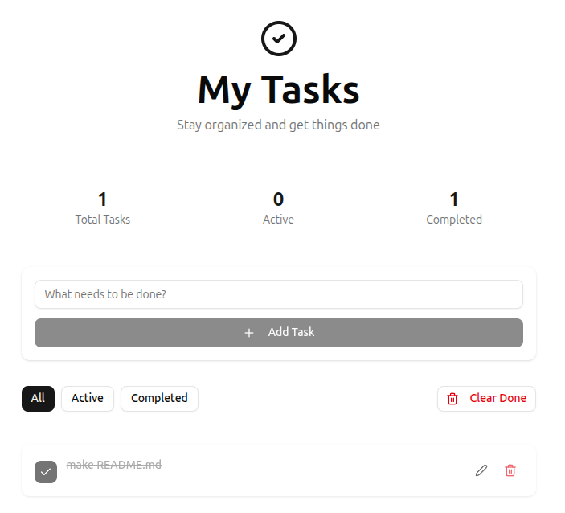

🗂️ Task Manager App

A simple task manager application built to practice full-stack development and containerization with Docker.

## Screenshots



## Project Overview

This Task Manager App was built as a learning project to understand how a full-stack application works end-to-end, including frontend development, backend APIs, database integration, and containerized deployment using Docker.

## Features

- Create, read, update, and delete tasks
- Mark tasks as completed
- Filter tasks by status (all, completed, pending)
- Responsive design for mobile and desktop
- RESTful API backend
- Dockerized for easy deployment

## Technologies Used

- React (Frontend)
- Python + Flask (Backend)
- MySQL (Database)
- Docker (Containerization)
- Docker Compose (Multi-container orchestration)

## What I Learned

Through this project, I learned:

- How to build a RESTful API using Flask
- How to connect a backend service to a MySQL database
- How to manage state and API calls in React
- How to containerize applications using Docker
- How to orchestrate multiple services with Docker Compose
- How to document and share a project using a README

## Prerequisites

- Docker installed on your machine
- Docker Compose installed on your machine
- Basic knowledge of Docker and Docker Compose

## Getting Started

1. Clone the repository:

   ```bash
   git clone https://github.com/matej-tomik/todo_list
   cd todo-list
   ```

2. Run the Docker containers:
   ```bash
   docker-compose up -d
   ```
3. Access the application:

   - Frontend: http://localhost:3000
   - Backend API: http://localhost:8000/docs

4. To stop the application, run:
   ```bash
   docker-compose down
   ```

## Project Structure

- `frontend/`: Contains the React application code.
- `backend/`: Contains the FastAPI code.
- `docker-compose.yml`: Docker Compose configuration file.
- `README.md`: Project documentation.

## Future Improvements

- User authentication
- Task priorities and due dates
- Search and sorting
- Deployment to a cloud platform

## Contributing

Contributions are welcome! Please fork the repository and create a pull request with your changes.

## License

This project is licensed under the MIT License. See the [LICENSE](LICENSE) file for details
